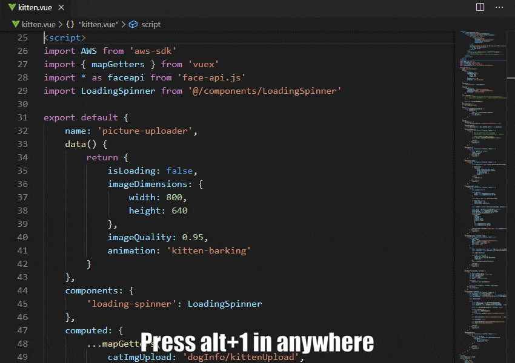
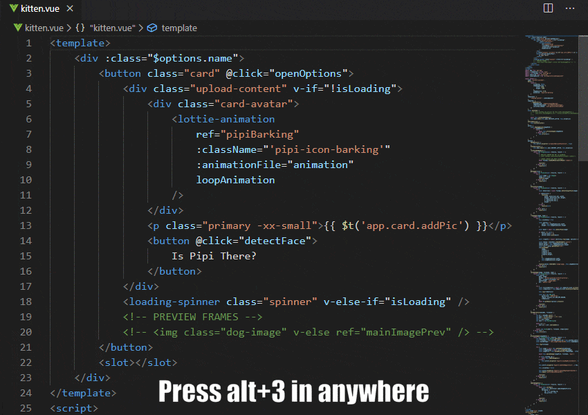

# Vue-Navigator

This extension helps you to move to HTML/CSS/JS much quicker in the same page.

## Key features

* Optimized for keyboard use
* No selection needed
* Navigate to different codes for fast coding
* Doesn't break codes

> ### Navigate to HTML(first<template>)
*  `Alt` + `1`

> ### Navigate to Javasript(<script>)
*  `Alt` + `2`

> ### Navigate to Javasript(<script>)
*  `Alt` + `3`

> ### Log the variable on cursor

> ### Type and log it as a string

> ### Keep your indents

> ### Use custom prefix

The fastest way to log your variables! Type it and press `Ctrl+Alt+W` + `W`.

Another way to `console.log` your variables is to simply place your **mouse cursor** on them and then wrap them on the line below with `Ctrl+Alt+W` + `Down` or the line above with `Ctrl+Alt+W` + `Up`.

Does the keyboard shortcuts seem to complex? Don't worry, they feel way more comfortable than they look. :)

Also, you are free to rebind all keyboard shortcuts as you want in your workspace and user settings files. :)

## Keyboard shortcuts

> ### Log as string
*Replace the word on your cursor or the selected text*

*  `Alt+Shift+W` + `W`

##### OBS: If the string to log contains spaces you need to select the whole string

---

### Log on current line
*Replace the variable on the mouse cursor*
> ### Wrap and replace

*  `Ctrl+Alt+W` + `W`

> ### With prefix

*  `Ctrl+Alt+W` + `Ctrl+Alt+W`

> ### With prefix (show input box)

*  `Ctrl+Shift+Alt+W` + `Ctrl+Shift+Alt+W`

---

### Insert **down**
*Insert console.log on the line below*

> ### Down

*  `Ctrl+Alt+W` + `Down`

> ### With prefix

*  `Ctrl+Alt+W` + `Ctrl+Alt+Down`

> ### With prefix (show input box)

*  `Ctrl+Shift+Alt+W` + `Ctrl+Shift+Alt+Down`

---

### Insert **up**
*Insert console.log on the line above*

> ### Up

*  `Ctrl+Alt+W` + `Up`

> ### With prefix

*  `Ctrl+Alt+W` + `Ctrl+Alt+Up`

> ### With prefix (show input box)

*  `Ctrl+Shift+Alt+W` + `Ctrl+Shift+Alt+Up`

