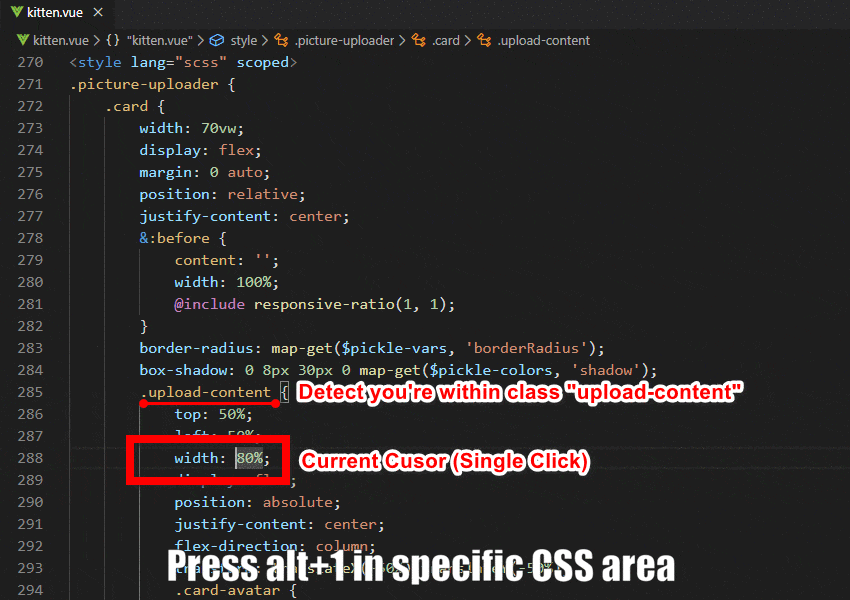
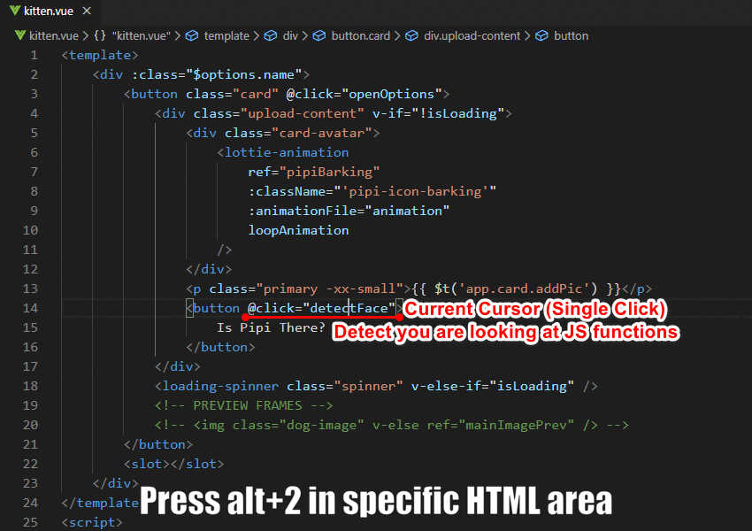

# Vue-Navigator

This extension helps you to quickly navigate to HTML/CSS/JS in the same page.

## Key features

* Optimized for keyboard use
* No selection needed
* Navigate to different parts(HTML-CSS-JS) for faster coding
* Doesn't break codes

--- 

## Basic Usage
> ### Navigate to HTML part
*  `Alt` + `1`

> ### Navigate to Javasript part
*  `Alt` + `2`

> ### Navigate to CSS part
*  `Alt` + `3`

---

## Advanced Usage (Auto-detection)
> ### Navigate to the exact HTML element with classname
*  `Alt` + `1` when your cursor in CSS area

> ### Navigate to the spcific JS function
*  `Alt` + `2` when your cursor is at v-model or @click event

---

## Future roadmap
* More support of Vue syntax (Router, Store)
* Ability of switching between files
* Adapt more/different coding styles